# **LLAvatarOS**: Animating Presence – Where Words Flow into Gestures Motion


## Introduction: The Eloquence of Embodied Communication


Envision digital personas whose bodies speak as fluently as their words, where a raised eyebrow punctuates a question, where hands dance to emphasize ideas, where shoulders rise and fall with the emotional rhythm of conversation. **LLAvatarOS** leverages the profound neural connections of LLaMA's transformer architecture to decode the hidden choreography between language and gesture, transforming lifeless avatars into expressive communicators that move with an uncanny human intuition. Inspired by the groundbreaking paper [*"LLAniMation: LLaMA-Driven Gesture Animation"*](https://arxiv.org/abs/2405.08042) (published May 2024), this project **is the first public implementation** of a state-of-the-art Transformer-based model for audio-driven gesture generation, tailored specifically for the AvatarOS dataset. Our proof of concept (PoC) demonstrates how speech can dance through upper-body movements, and we’re here to show AvatarOS why this is the future of animation.

Why Transformers over diffusion models? Gestures are a sequence: a story told frame by frame, where timing and context are everything. Transformers, with their sequence-to-sequence prowess, capture this narrative better than diffusion models, which are more suited for static generation tasks like images. Let’s break it down with a comparison:

| **Aspect**            | **Transformer-XL (Our Choice ♥️ )**                     | **Diffusion Model (e.g., CSMP-Diff)**           |
|-----------------------|----------------------------------------------------|------------------------------------------------|
| **Temporal Modeling** | ✅ Excels at long-range dependencies, perfect for gesture sequences. | 👎🏾 Struggles with strict temporal alignment, better for static outputs. |
| **Cross-Modal Integration** | ✅ Cross-attention seamlessly blends audio and text features. | 👎🏾 Requires complex adaptations for audio-text fusion. |
| **Training Efficiency** | ✅ Faster to train, fewer steps, ideal for a PoC.      | 👎🏾 Multiple denoising steps, computationally heavy. |
| **Gesture Quality**   | ✅ Proven in the paper to produce contextually rich gestures (e.g., semantic gestures like mimicking a fork). | 👎🏾 Focuses on human-likeness but lacks semantic depth without heavy tuning. |

By choosing the Transformer-based approach from the LLAnimation paper, we’re not just adapting code, we’re pioneering the first public implementation of a model that AvatarOS can use without licensing hurdles, setting the stage for state-of-the-art gesture animation.

## Why LLAnimation for AvatarOS?

The LLAnimation paper introduces a novel approach using LLaMA2 embeddings and a Cross-Attentive Transformer-XL to generate gestures that are both temporally aligned and contextually rich. Here’s why we chose to implement this over adapting existing diffusion-based code (e.g., DiffuseStyleGesture):

- **First Public Implementation**: The LLAnimation paper lacks a public codebase, making this the first public implementation: a unique opportunity for AvatarOS to lead in gesture animation without licensing constraints.
- **State-of-the-Art Performance**: The paper’s user study shows LLAnimation outperforming the state-of-the-art CSMP-Diff 47.5%–50% of the time, despite being simpler and more efficient.
- **Tailored for AvatarOS**: We adapted the model to the simplified AvatarOS dataset (upper torso only), ensuring compatibility while maintaining the paper’s core strengths.


### Why Gestures Matter
Gestures add meaning to speech. Think of pointing while giving directions or nodding to say “yes.” In animation (games, movies, virtual avatars), syncing gestures with speech makes characters feel alive. Historically, most systems used audio features (like pitch or loudness) because they’re closely tied to gesture timing. But this paper says text can work too, thanks to LLMs like LLAMA2, which understand language deeply.


### The Big Idea: Using LLAMA2 and Transformers
We use LLAMA2 to extract text features and feed them into a Transformer-based model to predict gestures. Here’s the high-level flow:
1. **Input**: Audio and text (the transcript of someone speaking).
2. **Feature Extraction**: LLAMA2 turns text into rich embeddings, while audio gets processed into embeddings too (using PASE+).
3. **Model**: A Transformer predicts body poses (e.g., hand positions) for each frame of animation (30 frames per second).
4. **Output**: A sequence of gestures that match the speech.


### Step 1: Why Transformers?
Transformers don’t process things one-by-one. They look at the whole sequence at once using **attention**. This makes them fast and powerful.

Imagine you’re reading a sentence: “I’m eating crab with a fork.” To predict a gesture (e.g., fork motion), you need to know:
- What’s being said (“eating crab”).
- How it’s said (timing, emphasis).
- Context (fork relates to eating).

Transformers use **self-attention** to figure out which words matter most for each part of the output. For example, “fork” might get more “attention” when predicting a hand motion than “I’m.”

In this implementation, we use a specific flavor called **Transformer-XL**, which is tweaked for longer sequences and remembering past context, perfect for animation where gestures flow over time.

### Step 2: Inputs to the Model
We prepare three main inputs:
1. **Text Features (LLAMA2)**:
   - LLAMA2.
   - We feed it a transcript (e.g., “I’m eating crab”), and it spits out embeddings: 4096-dimensional vectors for each word or token.
   - These embeddings capture meaning (e.g., “eating” implies action, “crab” is food). We’re aligned to 30 fps by repeating vectors for the duration of each word.
   - Example: If “eating” lasts 0.5 seconds (15 frames), its embedding gets copied 15 times.

2. **Audio Features (PASE+)**:
   - PASE+ is a model that turns audio into 768-dimensional vectors every 33ms (matching 30 fps).
   - It captures prosody (pitch, energy), stuff that hints at when to gesture (e.g., a loud “YES!” might trigger a nod).

3. **Speaker Style**:
   - We add an 8-dimensional vector to tag the speaker, so the model learns different gesture styles (e.g., some people wave more than others).

### Step 3: The Transformer-XL Model
The core of *LLAvatarOS* is a **Cross-Attentive Transformer-XL**. Let’s break it down:

#### Transformer-XL Basics
- **Standard Transformer**: Has an encoder (processes input) and decoder (generates output). It uses attention to weigh inputs and predict outputs.
- **Transformer-XL Upgrade**: Adds “recurrence” to handle long sequences. It reuses hidden states from previous chunks of data, so it remembers what happened earlier (e.g., a gesture from 2 seconds ago affects now).
- **Why XL?**: Animation needs smooth, continuous motion. Regular Transformers forget too much over time, but XL keeps context alive.

#### Cross-Attention Twist
- In a two-person convo (dyadic), they predict gestures for the “main agent” (the speaker) while also considering the “interlocutor” (the listener).
- **Cross-attention** lets the model look at both speakers’ inputs (text/audio) and decide how they influence the main agent’s gestures.
- Example: If the interlocutor says “Really?”, the main agent might nod. Cross-attention connects the two.

#### How It Works
1. **Input**: A chunk of features (e.g., 100 frames of LLAMA2 embeddings, PASE+ embeddings, and speaker IDs).
2. **Processing**:
   - **Self-Attention**: Within each speaker’s data, the model figures out which words/frames matter most.
   - **Cross-Attention**: Between speakers, it weighs how the interlocutor’s speech affects the main agent.
3. **Output**: A sequence of body poses (x, y, z coordinates + joint rotations) for each frame.

The model predicts poses like `[px, py, pz, qx, qy, qz, qw]` for every joint (e.g., wrist, elbow) at 30 fps.

## Implementation: A Step-by-Step Journey

Let’s dive into how we brought **LLAvatarOS** to life. Below is a detailed breakdown of our implementation, complete with Mermaid diagrams to visualize the process.

### Step 1: Data Pipeline – Aligning Speech and Motion

The AvatarOS dataset provides `.npy` files with shape `(num_frames, num_points, 7)` (position `[px, py, pz]` and quaternion `[qx, qy, qz, qw]`) and `.wav` audio files. We need to align audio with text and extract features for the model. Here’s the pipeline:


- **Transcription**: We use Whisper to transcribe `.wav` files into text, as the dataset lacks transcripts.
- **Alignment**: The Montreal Forced Aligner (MFA) extracts word-level timings, aligning them with motion frames at 30fps (as per the paper’s 33ms frame rate).
- **Feature Extraction**:
  - **Audio (PASE+)**: PASE+ extracts 768-dimensional audio embeddings per 33ms window. Think of PASE+ as a musical ear that listens to the audio and captures its rhythm, tone, and energy, like a conductor interpreting a symphony to guide the orchestra (gestures).
  - **Text (LLaMA2)**: With granted access to the 7-billion parameter LLaMA2 model, we extract 4096-dimensional embeddings for each word token. Imagine LLaMA2 as a linguist who reads the transcript and understands the meaning behind each word. For example, for the sentence “I’m eating crab,” LLaMA2 breaks it into tokens (“I’m,” “eat,” “ing,” “crab”) using Byte-Pair Encoding (BPE). It then generates an embedding for each token, with the final token’s embedding (e.g., “crab”) capturing the context of the whole word. These embeddings are repeated across frames to match the 30fps motion timing, ensuring the gesture for “crab” aligns with when the word is spoken.
  - **Speaker Style**: An 8-dimensional speaker embedding captures style variations. Picture this as a personality fingerprint: each speaker has a unique way of gesturing, and this embedding ensures the model knows who’s “dancing.”
- **Skeleton Reconstruction**: The AvatarOS skeleton (upper torso) is represented as 9 joints, as shown in the provided image:

```mermaid
flowchart BT
    %% BT = Bottom to Top direction to make spine point downward
    
    %% Main nodes with circles and icons
    0((("0 🔄"))):::root
    1((("1 ⬆️"))):::spine
    2((("2 ⬆️"))):::spine
    3((("3 💪"))):::rightSide
    4((("4 💪"))):::rightSide
    5((("5 ✋"))):::rightSide
    6((("6 💪"))):::leftSide
    7((("7 💪"))):::leftSide
    8((("8 ✋"))):::leftSide
    
    %% Connections - reversed direction for spine
    0 --- 1
    1 --- 2
    2 --- 3
    3 --- 4
    4 --- 5
    2 --- 6
    6 --- 7
    7 --- 8
    
    %% Text labels with icons
    spine["spine 🔄"]:::spineLabel
    spine1["spine1 ⬆️"]:::spineLabel
    spine2["spine2 ⬆️"]:::spineLabel
    rightShoulder["Right Shoulder 👉"]:::rightLabel
    rightArm["Right Arm 💪"]:::rightLabel
    rightForeArm["Right Fore Arm ✋"]:::rightLabel
    leftShoulder["Left Shoulder 👈"]:::leftLabel
    leftArm["Left Arm 💪"]:::leftLabel
    leftForeArm["Left Fore Arm ✋"]:::leftLabel
    
    %% Position labels
    spine -.-> 0
    spine1 -.-> 1
    spine2 -.-> 2
    rightShoulder -.-> 3
    rightArm -.-> 4
    rightForeArm -.-> 5
    leftShoulder -.-> 6
    leftArm -.-> 7
    leftForeArm -.-> 8
    
    %% Style definitions with colors
    classDef root fill:#FF5252,color:white,stroke:#B71C1C,stroke-width:2px
    classDef spine fill:#FF9800,color:white,stroke:#E65100,stroke-width:2px
    classDef rightSide fill:#2196F3,color:white,stroke:#0D47A1,stroke-width:2px
    classDef leftSide fill:#4CAF50,color:white,stroke:#2E7D32,stroke-width:2px
    classDef spineLabel fill:none,stroke:none,color:#E65100,font-weight:bold
    classDef rightLabel fill:none,stroke:none,color:#0D47A1,font-weight:bold
    classDef leftLabel fill:none,stroke:none,color:#2E7D32,font-weight:bold
```




### Step 2: Model Architecture – LLaMA2 Embeddings and Cross-Attentive Transformer-XL

The core of **LLAvatarOS** is the Cross-Attentive Transformer-XL, which integrates audio, text, and speaker features to predict gestures. Let’s break down the key components:

- **LLaMA2 Embeddings**: LLaMA2, a 7-billion parameter Transformer-based language model, generates 4096-dimensional embeddings that encode the semantic and contextual meaning of each word. These embeddings are powerful because they capture not just the word itself but its role in the sentence. For instance, in “I’m eating crab,” the embedding for “crab” knows it’s a noun and the object of an action (eating), which helps the model generate a gesture like mimicking a fork motion (as shown in Fig. 1). The embeddings are aligned to 30fps by repeating them across frames where the word is spoken, ensuring temporal synchronization with the audio.


**Fig. 1.** We present a method for generating gestures from speech using Llama2 features derived from text as the primary input, producing temporally aligned and contextually accurate gesture animation. This sequence generated from our method shows a speaker mimicking the use of a fork with their right hand while describing eating crab.

- **Cross-Attentive Transformer-XL**: This architecture is a two-part marvel:
  - **Cross-Attention Mechanism**: Think of cross-attention as a conversation between audio and text. The audio features (PASE+, 768 dimensions) act as the “query,” asking, “What’s happening in the speech right now?” The text features (LLaMA2 embeddings, 4096 dimensions) act as the “key” and “value,” answering, “Here’s the meaning of the words being spoken.” Cross-attention computes a weighted combination of text features based on their relevance to the audio, creating a fused representation that captures both prosody (from audio) and semantics (from text). Mathematically, this is done using the attention formula, where \(Q\) is the audio features, and \(K\) and \(V\) are the text features: 

<span style="display: inline-block;">$$\text{Attention}(Q, K, V) = \text{softmax}\left(\frac{QK^T}{\sqrt{d}}\right)V$$</span>


  - **Transformer-XL**: Once the features are fused, Transformer-XL takes over to model the temporal sequence of gestures. Transformer-XL is an advanced version of the Transformer, designed for long sequences. It uses segment-level recurrence and relative positional encodings to maintain temporal coherence across frames. For a sequence of \(N\) frames, it processes the data in non-overlapping segments of length \(W\), predicting joint positions and rotations for each segment. The recurrence mechanism allows it to “remember” previous segments, ensuring smooth transitions: like a dancer who remembers the last move to flow into the next.

Here’s the architecture visualized:


- **Smoothing**: A Savitzky-Golay filter (window length 9, polynomial order 2) reduces high-frequency noise in the output, ensuring the gestures look natural and fluid.

### Step 3: Training and Inference


- **Training:** We trained on a small subset of the **AvatarOS dataset** for the PoC, using the **AdamW optimizer** for 10 epochs. A full run, as suggested by the paper, would involve **1300 epochs**. The paper’s training setup (1300 epochs on the **GENEA 2023** dataset). Let’s make the calculations for **60 fps** and **25 hours of WAV audio** similar forn the **GENEA 2023** dataset values. 

#### **Assumptions**
1. **Dataset Size:**  
   - **25 hours of WAV audio** at **60fps** (frames per second).  
   - Total frames:  
     $$
     25 \, \text{hours} \times 3600 \, \text{seconds/hour} \times 60 \, \text{frames/second} = 5,400,000 \, \text{frames}.
     $$

2. **Model Architecture:**  
   - **Cross-Attentive Transformer-XL** with **50M parameters**.  
   - Segment length (\( W \)) = **512 frames**.  
   - Batch size = **16**.

3. **Text Processing:**  
   - Transcription using **Whisper**.  
   - Embedding generation using **LLaMA2**.  

4. **GPU Performance:**  
   - **NVIDIA V100** with **125 TFLOPs/s (FP16)**.  


#### **Step 3.1: Training Iterations**
- **Iterations per Epoch:**  
  $$
  \text{Iterations per epoch} = \frac{5,400,000}{512 \times 16} = 660 \, \text{iterations per epoch}.
  $$


#### **Step 3.2: FLOPs for Training**
- **FLOPs per Iteration:**  
  - A **Transformer-XL** forward pass for a **512-frame segment** with **50M parameters** involves approximately **10 TFLOPs**.  
  - Backpropagation typically doubles this, so **20 TFLOPs per iteration**.  

- **Total FLOPs for Training (1300 epochs):**  
  $$
  660 \times 1300 \times 20 = 17,160,000 \, \text{TFLOPs}.
  $$

#### **Step 3.3: Text Processing and Embedding Generation**
#### **Text Transcription (Whisper):**
- **Whisper FLOPs:**  
  - Whisper is a lightweight model compared to Transformers. For **25 hours of audio**, transcription typically takes **~1.25 hours** on a V100 GPU.  
  - FLOPs for transcription:  
    $$
    1.25 \, \text{hours} \times 3600 \, \text{seconds/hour} \times 125 \, \text{TFLOPs/s} = 562,500 \, \text{TFLOPs}.
    $$

#### **Embedding Generation (LLaMA2):**
- **LLaMA2 FLOPs:**  
  - LLaMA2 is computationally expensive. For **25 hours of audio**, generating embeddings for all words takes approximately **~6.25 hours** on a V100 GPU.  
  - FLOPs for embedding generation:  
    $$
    6.25 \, \text{hours} \times 3600 \, \text{seconds/hour} \times 125 \, \text{TFLOPs/s} = 2,812,500 \, \text{TFLOPs}.
    $$


#### **Step 3.4: Total FLOPs**
- **Training FLOPs:** 17,160,000 TFLOPs.  
- **Text Transcription FLOPs:** 562,500 TFLOPs.  
- **Embedding Generation FLOPs:** 2,812,500 TFLOPs.  

- **Total FLOPs:**  
  $$
  17,160,000 + 562,500 + 2,812,500 = 20,535,000 \, \text{TFLOPs}.
  $$


#### **Step 3.5: Training Time**
- **GPU Performance:** 125 TFLOPs/s.  
- **Total Training Time:**  
  $$
  \frac{20,535,000}{125} = 164,280 \, \text{seconds} \approx 45.63 \, \text{hours}.
  $$

#### **Step 3.6: Accounting for Overheads**
- **I/O Overhead and Optimization:**  
  - Data loading, preprocessing, and checkpointing can add **~20-30% overhead**.  
  - Adjusted training time:  
    $$
    45.63 \, \text{hours} \times 1.25 = 57.04 \, \text{hours} \approx 2.38 \, \text{days}.
    $$


#### **Final Summary**
- **Dataset Size:** 25 hours of WAV audio (5,400,000 frames at 60fps).  
- **Training Iterations:** 660 iterations per epoch.  
- **Total FLOPs:** 20,535,000 TFLOPs.  
- **Training Time:** ~57.04 hours (2.38 days) on an NVIDIA V100 GPU.  


#### **Inference Time**
- **Output Files:**  
  - `.npy` files with predicted gestures.  
  - `.mov` videos for visualization.  
- **Inference Speed:**  
  - Real-time or near-real-time performance on a V100 GPU.  


## Setup Instructions: Let’s Get Moving!

### Advantages of Our Code

- **Containerized Setup**: The Docker-based setup ensures reproducibility across systems, making it easy for AvatarOS engineers to test and scale.
- **Modular Design**: Separate modules for data loading, alignment, and modeling allow for easy experimentation.
- **Scalability**: The codebase is ready for full training, with configurations in `config/model_config.yaml`.
Below is the folder structure, followed by a detailed breakdown of each directory and file.

```text
LLAvatarOS/
│
├── Dockerfile                  # Docker configuration for reproducible setup
├── requirements.txt            # Python dependencies for the project
│
├── config/                     # Configuration files for models and tools
│   ├── model_config.yaml       # Transformer-XL model hyperparameters
│   └── pase_config.cfg         # PASE+ audio feature extraction settings
│
├── data/                       # Data storage and output directories
│   ├── datasets/               # Input dataset storage
│   │   └── zaos1/              # AvatarOS dataset with .npy (motion) and .wav (audio) files
│   ├── alignments/             # Output directory for MFA word-level alignments
│   └── resources/              # Media files for documentation
│       ├── images/             # Images for README (e.g., skeleton diagram)
│       └── videos/             # Generated gesture animation videos (e.g., .mov files)
│
├── models/                     # Model implementations
│   ├── __init__.py             # Makes the directory a Python package
│   ├── pase_model.py           # Wrapper for PASE+ audio feature extraction
│   ├── llama_model.py          # Wrapper for LLaMA2 text feature extraction
│   └── transformer_xl.py       # Cross-Attentive Transformer-XL model implementation
│
├── utils/                      # Utility functions and helpers
│   ├── __init__.py             # Makes the directory a Python package
│   ├── data_loader.py          # Data loading and preprocessing utilities
│   ├── aligner.py              # Montreal Forced Aligner (MFA) wrapper for audio-text alignment
│   └── smoothing.py            # Savitzky-Golay smoothing for gesture post-processing
│
├── scripts/                    # Scripts for training and inference
│   ├── train.py                # Script to train the Transformer-XL model
│   └── inference.py            # Script to generate gestures from audio input
│
└── main.py                     # Entry point for running the project (train, infer, or test modes)
```

Follow these steps to run **LLAvatarOS** and see gestures come to life:


1. **Install NVIDIA Container Toolkit**:

    - Add the NVIDIA Container Toolkit Repository:
    ```bash
    curl -fsSL https://nvidia.github.io/libnvidia-container/gpgkey | sudo gpg --dearmor -o /usr/share/keyrings/nvidia-container-toolkit-keyring.gpg
    ```
    ```bash
    curl -s -L https://nvidia.github.io/libnvidia-container/stable/deb/nvidia-container-toolkit.list | \
      sed 's#deb https://#deb [signed-by=/usr/share/keyrings/nvidia-container-toolkit-keyring.gpg] https://#g' | \
      sudo tee /etc/apt/sources.list.d/nvidia-container-toolkit.list
    ```
    - Update the Package List:
    ```bash
    sudo apt-get update
    ```
    - Install the NVIDIA Container Toolkit:
    ```bash
    sudo apt-get install -y nvidia-container-toolkit
    ```
    - Configure the Docker Daemon to Use the NVIDIA Runtime:
    ```bash
    sudo nvidia-ctk runtime configure --runtime=docker
    ```
    - Restart the Docker Daemon:
    ```bash
    sudo systemctl restart docker
    ```


2. **Clone the Repository**:
   ```bash
   git clone https://github.com/santuario/llavataros
   cd llavataros
   ```

3. **Prepare the Dataset**:
   - Place `.wav` and `.npy` files in `data/datasets/zaos1/`.
   - Create output directories:
     ```bash
     mkdir -p data/alignments data/animations
     ```

4. **Build the Docker Image**:
   ```bash
   sudo docker build -t llanimation-avataros .
   ```

5. **Run the PoC**:
   - Test the pipeline:
     ```bash
     sudo docker run --runtime=nvidia --gpus all -v $(pwd)/data:/app/data llanimation-avataros /bin/bash -c "source /opt/conda/etc/profile.d/conda.sh && conda activate mfa && python test_modules.py"
     ```
   - Train on a small subset:
     ```bash
     sudo docker run --runtime=nvidia --gpus all -v $(pwd)/data:/app/data llanimation-avataros /bin/bash -c "source /opt/conda/etc/profile.d/conda.sh && conda activate mfa && python main.py --mode train --test"
     ```
   - Full train:
     ```bash
     sudo docker run --runtime=nvidia --gpus all -v $(pwd)/data:/app/data llanimation-avataros /bin/bash -c "source /opt/conda/etc/profile.d/conda.sh && conda activate mfa && python main.py --mode train"
     ```
   - Generate animation:
     ```bash
     sudo docker run --runtime=nvidia --gpus all -v $(pwd)/data:/app/data llanimation-avataros /bin/bash -c "source /opt/conda/etc/profile.d/conda.sh && conda activate mfa && python main.py --mode infer --audio_path data/datasets/zaos1/001_Neutral_0_mirror_x_1_0.wav --output_npy_path data/animations/001_Neutral_0_mirror_x_1_0_animation.npy --output_mov_path data/animations/001_Neutral_0_mirror_x_1_0_animation.mov"
     ```

6. **Hardware Requirements**:
   - NVIDIA GPU (16GB VRAM), 32GB RAM, 100GB disk space.
   - CUDA 12.6, NVIDIA Container Toolkit.

## Video Preview: A Glimpse of the Magic

Check out the video in `data/animations/animation.mov` to see our PoC in action! While not fully trained, the gestures align with the audio’s rhythm, showing the potential for expressive, context-aware animation. Imagine a speaker’s torso swaying in sync with their words: **LLAvatarOS** is just getting started, and with full training, it’ll be ready to dance its way into AvatarOS’s state-of-the-art lineup.

[Watch the animation](data/animations/animation.mov)


## Feasibility Analysis: Why Full Training is Worth It

- **Initial Results**: The PoC generates gestures that align with audio timings (thanks to MFA) and show basic patterns (e.g., torso shifts with speech rhythm). However, the movements lack smoothness and semantic richness due to limited training.
- **Evidence of Success**: The model captures temporal alignment, as seen in the video, and the architecture matches the paper’s proven design (e.g., beat gestures in sync with audio, as shown in Fig. 2).


**Fig. 2.** Generated gestures for given audio beats using our method. Using a 1.5s audio clip from the test dataset, we show the audio spectrogram, as well as aligned audio beat onsets and their corresponding onset strengths, as well as motion gesture onset detection of the left wrist using the method of beat detection defined in [Liu et al. 2022](https://arxiv.org/abs/2203.05297). The speaker moves their left hand from right to left and back again as the syllables are stressed.

- **Justification for Full Training**:
  - The paper’s results (Table 1) show [LLAnimation](https://arxiv.org/abs/2405.08042)) achieving competitive FGD (61.86) and BA (0.855) scores even without audio features, suggesting that with full training, we can close the gap to ground truth.
  - Full training (1300 epochs, ~3 days on an NVIDIA V100) will enhance gesture expressiveness, as the Transformer-XL can learn more nuanced patterns with more data.
- **Training Estimate**:
  - PoC training (10 epochs) took ~6 hour on an RTX 4070.
  - PoC training (10 epochs) took ~1 hour on an RTX L40S.
  - Full training: ~2.38 days on an NVIDIA V100, as calculated above.

Here’s a hypothetical training loss graph for a full cycle, based on the paper’s methodology:


## Future Roadmap: 3-6 Months to State-of-the-Art

Here’s our plan to take **LLAvatarOS** to the next level:

- **Month 1-2**: Full Training and LLaMA2 Optimization
  - **Full Training (1300 Epochs)**: The PoC shows promise, but the gestures lack smoothness and semantic depth. Full training will allow the model to learn nuanced patterns, improving metrics like FGD and BA, and making gestures more human-like.
  - **LLaMA2 Optimization**: While we’ve used the 7B-parameter LLaMA2, fine-tuning it with in-context learning (as suggested in the paper) will enhance its ability to encode gesture-specific semantics, leading to more contextually accurate gestures (e.g., better mimicking actions like eating crab).
- **Month 3-4**: Model Enhancement
  - **Fine-Tune LLaMA2 for Gesture Tasks**: Fine-tuning will adapt LLaMA2 to the gesture domain, improving its embeddings for words with strong gestural associations (e.g., “yes” triggering a nod). This is crucial for closing the gap to ground truth, as the paper notes LLAnimation’s potential for semantic gestures.
  - **Expand Skeleton (Head and Hands)**: The AvatarOS dataset is torso-only, but real-world applications need full-body gestures. Adding head and hand movements will make the model more versatile, enabling applications like virtual avatars in gaming or VR.
- **Month 5-6**: Evaluation and Deployment
  - **User Study vs. CSMP-Diff**: The paper shows LLAnimation winning 47.5%–50% against CSMP-Diff. A user study will validate improvements post-training, aiming to surpass CSMP-Diff’s win rate and establish **LLAvatarOS** as the new state-of-the-art.
  - **Real-Time Deployment with API**: Deploying as a real-time tool with an API will enable creative applications (e.g., live avatar animation in video calls). This aligns with AvatarOS’s goal of leading in animation technology, providing a practical, scalable solution.

## Conclusion: A Gesture Towards the Future

**LLAvatarOS** is more than a PoC: **it’s a gateway to a new era of gesture animation for AvatarOS**. By implementing the LLAnimation paper’s state-of-the-art approach, we’ve shown that Transformers can bring speech to life with meaningful, context-aware gestures. The initial results are a teaser of what’s to come, and with full training, AvatarOS can lead the way in creating animations that don’t just move, they speak!. Let’s take this dance to the next level!

